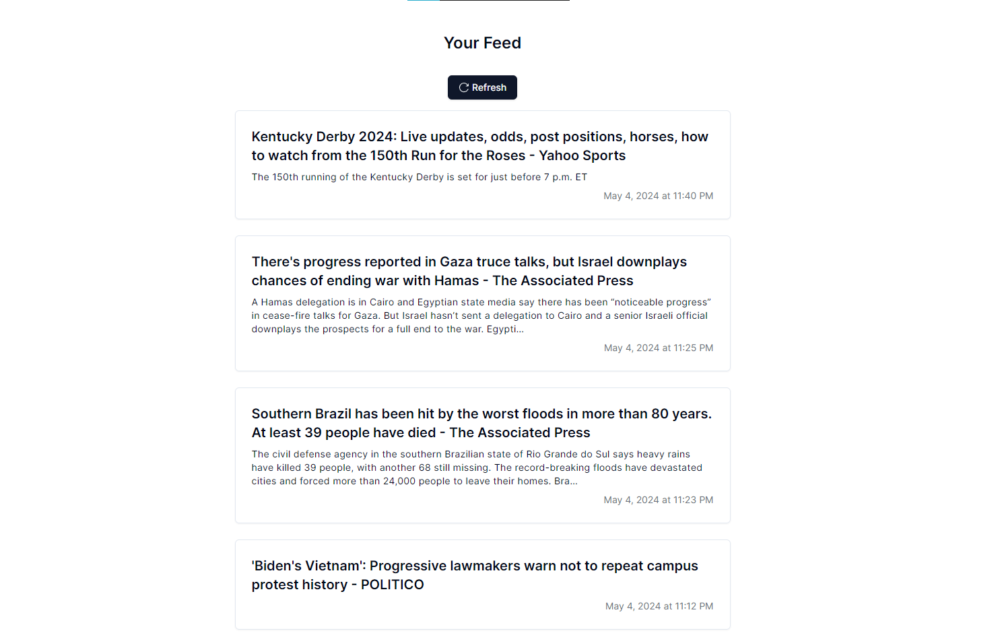

<br />
<div align="center">
  <h3 align="center">News App</h3>

  <p align="center">
   Simple News App Built with Next.js and Tailwind CSS
    <br />
    <br />
  </p>
</div>

  <details>
  <summary>Table of Contents</summary>
  <ol>
    <li>
      <a href="#about-the-project">About The Project</a>
      <ul>
        <li><a href="#built-with">Built With</a></li>
      </ul>
    </li>
    <li>
      <a href="#getting-started">Getting Started</a>
      <ul>
        <li><a href="#prerequisites">Prerequisites</a></li>
        <li><a href="#installation">Installation</a></li>
      </ul>
    </li>
    <li><a href="#contact">Contact</a></li>
  </ol>
</details>

## About The Project

[](https://github.com/Elalfy74/news-app)

- News App Let the user browse latest news
- User can see new details by clicking on the new
- User can refresh new by clicking on the refresh button
- Utilized Tanstack React Query to cache the data
- Built with Next.js and Tailwind CSS and Shadcn Components

### Built With


## Getting Started

### Prerequisites

- Node.js
- npm
- News Api Key

### Installation

1. Clone the repo
   ```sh
   git clone https://github.com/Elalfy74/news-app
   ```
2. Install NPM packages
   ```sh
   npm i
   ```
3. Rename 'env.example' to 'env'
4. Configure .env Variables
   replace default values with your own
5. Start the project
   ```sh
   npm run dev
   ```

## Contact

Mahmoud Elalfy - [@Mahmoudelalfy74](https://twitter.com/Mahmoudelalfy74) -
[@Portfolio](https://mahmoud-elalfy.vercel.app/) -
[@LinkedIn](https://www.linkedin.com/in/mahmoud-elalfy-79b894209/)

Project Link: [News App](https://github.com/Elalfy74/news-app)
